# 日语音读规律，两条真的够吗？

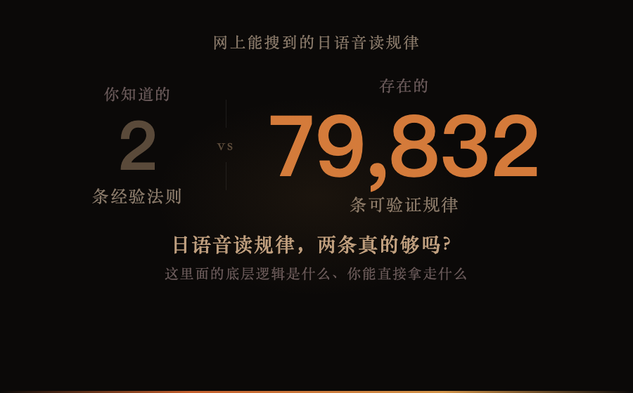
*图：2 条经验法则 vs 79,832 条可验证规律 — 这不是改进，是换维*

沪江日语有一篇文章，标题叫「日语汉字的音读规律」。它教了两个规律。

第一个：通过汉语拼音的声母，可以推断日语音读属于哪一行——比如「電（dian）话」对应「でん（den）わ」，「土（tu）地」对应「と（to）ち」。也就是：声母定行。

第二个：汉语前鼻音（an/in/en）对应日语的拨音ん，后鼻音（ang/ing/eng）对应长音。即：韵尾定长短。

作者说第一条「命中率十之八九」，第二条「命中率约等于全部」。真是如此吗？仅仅如此吗？

如果你在学日语，你可能已经感觉到了：日语汉字的音读好像还有更多规律，但又说不清楚有多少、哪些能信。去网上搜，能找到的大概就这么多了——几篇文章，两三条经验法则，举了几十个例子，而已。

而我想知道的是：如果把所有可能的规律穷举一遍——拼音的、中古音的、汉字部件的——能找出多少条？其中多少条真正靠谱？

**79,832 条**规律被系统性地发现和验证。其中 4,218 条精度超过 80%。

这篇文章说的是：这里面的底层逻辑是什么、你能直接拿走什么。

我们先看看，规律都有哪些种类？

—— 拼音规律：你早就在用了 ——

「関」读カン。管、館、観、貫、冠——也读カン。共同点：拼音都是 g+uan。

不是巧合。我跑了数据：拼音 g+uan 对应的 JLPT 汉字，音读全是カン。23 个字，无一例外。

更关键的是，这不是孤例：

**j+ian** → ケン（健、建、見、鍵、剣）
**x+in** → シン（新、心、信、辛）
**sh+eng** → セイ（声、生）
**b+ian** → ヘン（便、辺、弁、変）
**y+ou** → ユウ（有、由、友、右、油、遊）

每一条都是 **100%** 精度。小学学拼音的时候就已经掌握了这套规则的入口——汉语拼音的声母和韵母组合，系统性地对应着日语音读。

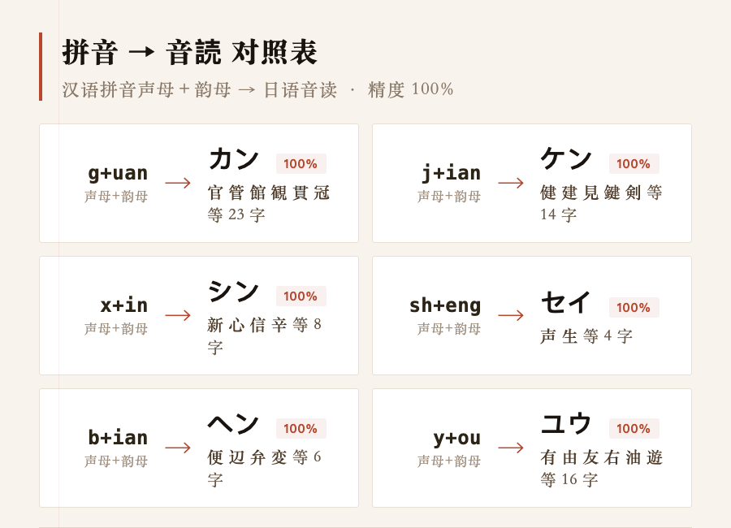
*图：汉语拼音声母＋韵母 → 日语音读 精确对照*

但拼音只能解释一部分。具体能覆盖多少、精度多高——我放到后面的实测数据里一起说。

—— 拼音解释不了的时候 ——

「生」的音读是セイ和ショウ。「上」是ショウ和ジョウ。拼音都是 sh+eng / sh+ang，为什么有时候长音、有时候浊音？

这时候得搬出一个概念：中古音（MC）——隋唐时期中国人怎么读汉字。宋朝人编的《廣韻》把这些读音全记录下来了。日本人分两波大规模引进汉字——南北朝一次（呉音）、唐朝一次（漢音）——汉语在两个时期的发音差别，在日语里凝固成了两套读音。

「行」读 xing，为什么日语里有时读コウ（銀行）、有时读ギョウ（修行）？因为中古音里「行」的声母是「匣」——一个浊辅音。呉音保留了浊音，对应ギョウ；漢音把浊音清化了，对应コウ。

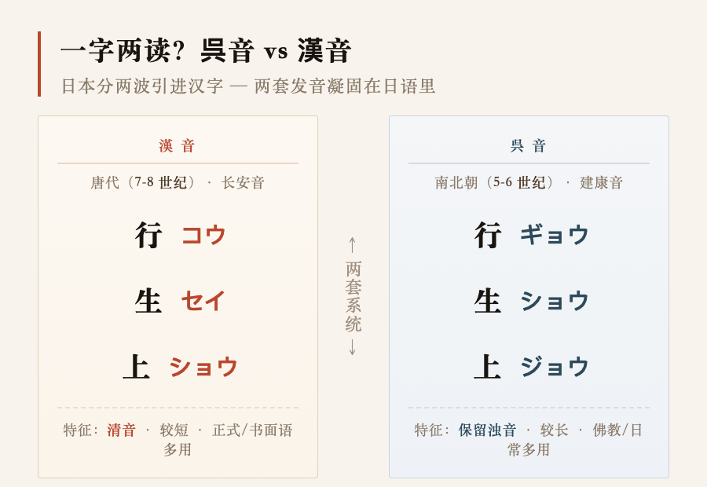
*图：日本分两波引进汉字，两套发音凝固在日语里*

从中古音出发，能找出更细的规律：

MC 韵母「**清**」+ 鼻音 **ng** → セイ（清、晴、静、精、情——23 字全对）
MC 韵母「**皆**」→ カイ（皆、介、階、界——100%）
MC 韵母「**痕**」→ コン（根、恨——100%）

精度仍然很高。但解释起来多了一步——你得先知道这个字的中古音分类。

而下一批规律，门槛不仅降回来了，比拼音还低——你小学就会。

—— 看偏旁猜读音：你小学就会 ——

「方」读ホウ。坊、妨、房、放、肪、紡——也读ホウ。

「建」→ ケン。健、鍵——ケン。

「交」→ コウ。校、餃——コウ。

汉字大约 80% 是形声字——一个字分成两部分，一部分提示意思，一部分提示读音（声旁）。「看到不认识的字，读半边」——中国人从小就这么干。

日语完整保留了这套逻辑。我跑数据发现：声符规律精度出奇地高——只要某个声符至少对应两个字，读音规律**几乎全是 100%**。

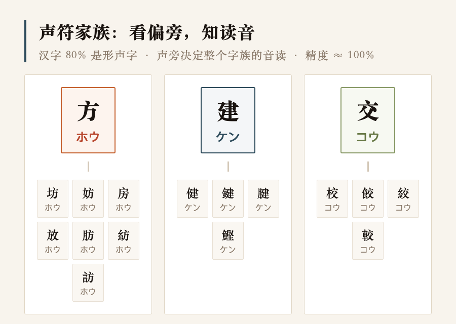
*图：同一个声符的字，音读几乎一定相同——日语完整保留了汉字形声系统*

—— 机器来找，人来看 ——

前面三种规律——拼音的、中古音的、部件的——有一个共同点：都是人先想到了，才去验证的。

g+uan → カン，是人先决定「检查拼音组合能不能预测音读」，然后跑数据确认。中古音声母加韵母的配对，也是人先画好了框。

这没什么不对。但天花板就是：**你只能验证你想到的东西**。

阿尔法Go早就证明，AI在找规律这个事情上，比人厉害太多。它找到的棋路，人类棋手下了两千年没下出来。

**AI 时代，学习方向是反过来的：人必须向AI学习。**

让机器先去找。人不知道哪些特征组合有用——没关系。把拼音的、中古音的、部件的、结构的所有特征全扔给一个叫 XGBoost 的模型，让它自己从数据里嗅模式。

嗅出来之后，用决策树把机器的发现翻译成人能读的 if-then。决策树就是一连串「如果 A 满足，再如果 B 满足，那么结果就是 X」——简单到一眼看完。

我跑了一轮。比如这条：一个汉字的 MC 声类是「齒音」、MC 韵摄是「止」、拼音韵母是「i」——三个条件同时满足时，音读 87% 是シ。

这不是人想出来的。是人压根不会想到去试这三个条件的组合。机器找到之后，人审一遍，标上精度，这条发现就变成了人的知识。

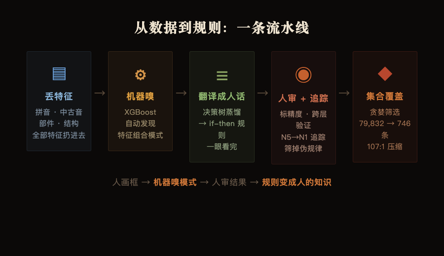
*图：从数据到规则 — 丢特征 → 机器嗅 → 翻译成人话 → 人审追踪 → 集合覆盖*

**可解释 AI**：不是追求一个更黑的黑箱替你答题——是让机器去发现你不知道该往哪看的东西，然后把这些发现翻译成你能记住、能用的规则。机器变聪明了，你也在跟着变聪明。

这条流水线在 N1 级 2,179 个汉字上跑出了 79,832 条规则。然后用贪婪集合覆盖——简单说就是「每次挑覆盖最多汉字的规则，选完再从剩下的挑」——压缩到 746 条。107 条压成 1 条。

我还做了一件事：**跨层追踪**。

一条规则如果在 N5 精度 95%，到了 N1 还在同一批字上精度 92%——说明它不是碰巧，是结构性的。反过来，如果 N5 精度 95%、到 N1 掉到 60%——那就是在小样本上看着好看，不是真规律。这套追踪筛掉了几百条伪规律。

—— 数字说话：两条 vs 五条 ——

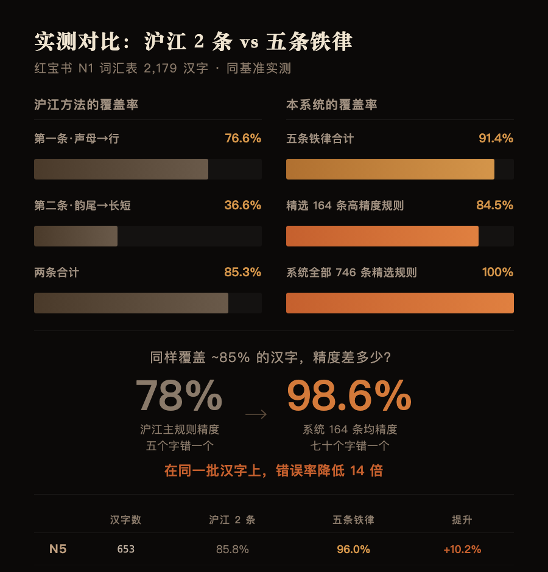
*图：红宝书 N1 词汇表 2,179 汉字实测对比*

在给结论之前，先看实测。

我用红宝书 N1-N5 词汇表里 2,179 个汉字做了对比测试。给沪江的两条规律配上最优的映射表——就是那篇文章没给的、我从数据里补全的完整对应——然后跟五条铁律一起跑一遍。

第一条（声母→行），配上最优映射表，在 2,179 个汉字中命中了 1,669 个。但精度只有 **78%**。**五个字里错一个**。

第二条（韵尾→长短），命中 798 个，精度 98.5%。几乎全对——但这个规律只对有鼻音韵尾的字生效，覆盖不到四成。

两条合在一起，覆盖了 N1 里 85.3% 的汉字。

加上第三条（声符→同音）和第四条（入声→尾部），覆盖推到 91.4%。多覆盖了 132 个字。

但这不是最重要的差距。最重要的是第三条和第四条给出的是之前完全没提的方向——看到方就知道ホウ，看到入声就知道尾部类型。不是精度替代，是维度替代。

但真正的分水岭在后面。

开篇的两条规律，本质上是在说**「大概往这个方向猜」**——声母定行，78% 精度，五个字错一个。方向有，但不够用。j→カ行，但 j+ian 和 j+in 和 j+ing 都去カ行吗？不是。j+ian→ケン，j+in→キン，j+ing→ケイ——同一声母，不同韵母，不同答案。两条规律回答不了这个粒度的问题。

这就是 79,832 条规则的意义。不是数字大就厉害——是**粒度**。每条规则精确到一个具体的特征组合，精度从 78% 拉到 98.6%。

怎么从 79,832 条里挑出最能打的？贪婪集合覆盖——每一轮挑出覆盖最多未命中汉字的规则，选完再从剩下的挑。107 条压成 1 条。

**集合覆盖后的结果**：323 条拼音 + 声符规则协同作战，覆盖了 N1 84.5% 的汉字。其中 164 条高精度规则，平均精度 98.6%。同一个覆盖率量级，精度从 **78% 跳到了 98.6%**。错误率降低 14 倍。

下面是五条铁律。每一条是你不需要跑任何代码就能上手用的。

—— 五条铁律 ——

79,832 条规则太细了。但在这几万条规则下面，只有五条底层原则。每一条是一类规则的母体。记住这五条，等于记住了一整套框架。

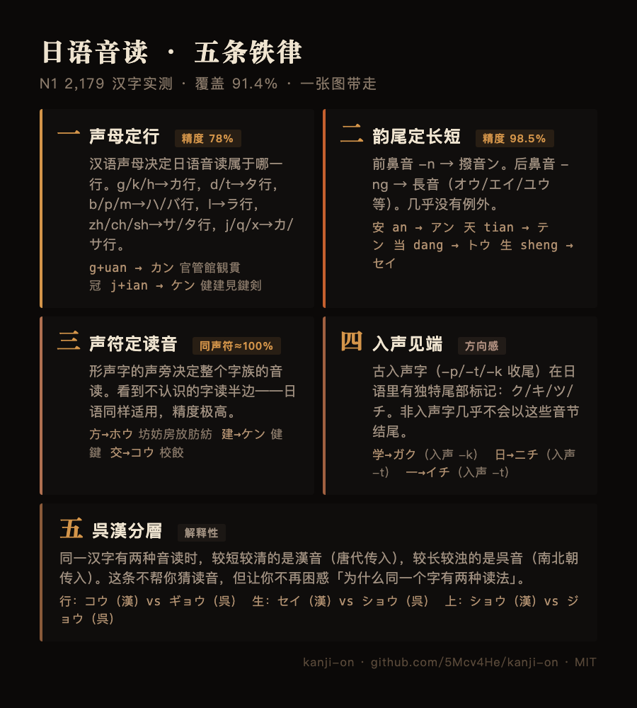
*图：五条铁律速查 — 保存到手机随时看*

**铁律一：声母定行**

汉语声母决定了日语音读属于哪一行。不是「大致相关」，是系统对应。

**g/k/h** → カ行（官=カン　工=コウ　海=カイ）
**d/t** → タ行（電=デン　土=ド　天=テン）
**b/p/m** → ハ/バ行（半=ハン　部=ブ　毎=マイ）
**l** → ラ行（来=ライ　旅=リョ　練=レン）
**zh/ch/sh** → サ/タ行（正=セイ　長=チョウ　少=ショウ）
**j/q/x** → カ/サ行（教=キョウ　七=シチ　新=シン）

这张表覆盖了声母对应的全部主干。沪江那篇文章的第一条规律说的就是这个——但文章只举了两个例子，没给完整的对应表。

在声母定行的大框架下，如果把韵母也加上——声母+韵母组合——精度跳到一个完全不同的量级：

**y+ou** → ユウ（有由友右油遊）　　**j+ian** → ケン（健建見鍵剣件検験）
**x+in** → シン（新心信辛）　　**b+ian** → ヘン（便辺弁変）
**g+uan** → カン（官管館観貫冠）　　**d+ian** → テン（電天殿点）
**d+ao** → トウ（道導）　　**g+ao** → コウ（高稿）
**h+uang** → コウ（黄皇）　　**l+ian** → レン（練連恋錬）
**l+in** → リン（林琳）　　**m+ing** → メイ（名命明）
**t+ian** → テン（天添）　　**l+iao** → リョウ（了料）
**t+ang** → トウ（堂糖）　　**t+ing** → テイ（定）
**k+an** → カン（刊）　　**r+en** → ジン（人仁）
**p+eng** → ホウ（朋）　　**h+ao** → コウ（好）

这就是声母定行的真正威力——不是「g→カ行」这种单维方向，而是「g+uan→カン」「j+ian→ケン」这种精确到具体韵母的锁定。

**铁律二：韵尾定长短**

前鼻音（-n）→ 撥音ン，短音。后鼻音（-ng）→ 長音（オウ/エイ/ユウ）。

**-n** → ン（安=アン　寒=カン　天=テン　人=ジン/ニン）
**-ng** → 長音（当=トウ　生=セイ　京=キョウ　零=レイ）

开篇说的第二条规律。但他们没说的是：这条规律的精度**几乎 100%**。只要汉字在汉语里有鼻音韵尾，日语读音的音节类型就被锁死了。几乎没有例外。

更进一步——入声韵尾类型（-k/-t/-p）+ MC声类的组合，能精确锁定音读尾部：

MC入声韵尾=ク + MC声类=喉 + MC韵母=蒸 → **ヨク**（100%）
MC入声韵尾=ツ + MC声类=牙 + MC韵母=寒 → **カツ**（100%）
MC入声韵尾=ク + MC声类=齒 + MC等=三 → **シュク**（89%）
MC声类=齒 + MC韵摄=梗 + 鼻音=-ng → **セイ**（88%）

**铁律三：声符定读音**

形声字的声旁决定了整个字族的音读。不是「有时候一样」，是几乎一定一样。

看到「方」→ ホウ。坊·妨·房·放·肪·紡——全是ホウ。看到「建」→ ケン。健·鍵——全是ケン。看到「中」→ チュウ。仲——チュウ。看到「交」→ コウ。校·餃——コウ。看到「令」→ レイ。零·冷——レイ。看到「皮」→ ヒ。被·疲——ヒ。

精度几乎 100%。日语完整保留了汉字形声系统的声旁一致性。更多代表：

**方**→ホウ（坊妨房放肪紡）　　**中**→チュウ（仲）
**交**→コウ（校餃）　　**包**→ホウ（抱胞泡砲）
**喬**→キョウ（橋矯）　　**長**→チョウ（張帳脹）
**兼**→ケン（嫌謙）　　**亢**→コウ（抗航）
**先**→セン（洗銑）　　**倉**→ソウ（創）
**則**→ソク（側測）　　**呈**→テイ（程）
**斉**→セイ（済）　　**央**→エイ（英）
**申**→シン（伸神）　　**門**→ブン（問聞）
**皮**→ヒ（被疲）　　**委**→イ（萎）
**容**→ヨウ（溶）　　**路**→ロ（露）

**铁律四：入声见端**

入声字（古汉语以 -p/-t/-k 结尾的字）在日语里有独特的尾部标记。遇到一个音读末尾是ク/キ/ツ/チ的汉字，它十有八九是古入声字。

- 学 → ガク（入声 -k）。日 → ニチ（入声 -t）。一 → イチ（入声 -t）。
- 反过来：非入声字几乎不会出现ク/キ/ツ/チ结尾。

这条不是 100%，但方向感很强。知道一个字是不是入声，能帮你锁定它音读的尾部类型。

**铁律五：呉漢分層**

日语保留了两个历史层次的读音。遇到一个字有两个音读时，较短较清的那个通常是漢音（唐朝传入），较长较浊的那个通常是呉音（南北朝传入）。

**行**　コウ（漢）⇄ ギョウ（呉）　　**生**　セイ（漢）⇄ ショウ（呉）　　**上**　ショウ（漢）⇄ ジョウ（呉）

这条铁律不增加你的记忆量。它是在帮你理解：为什么同一个字有时候读两种音——不是乱来的，是两套系统。和前四条不同，这条铁律不帮你猜读音。它解决的是另一个问题：你不再困惑「为什么同一个字有两个音」。

一个值得注意的事实：746 条精选规则中，**没有一条被标记为呉漢分層规则**。不是规律不存在——呉音的保留浊音、漢音的入声处理差异在数据中很明显——而是当前规则系统还没把「这条是呉音、那条是漢音」作为单独标签。这项数据增强计划在下个版本引入 KANJIDIC2 的 goon/kanon 标注后补齐。

---

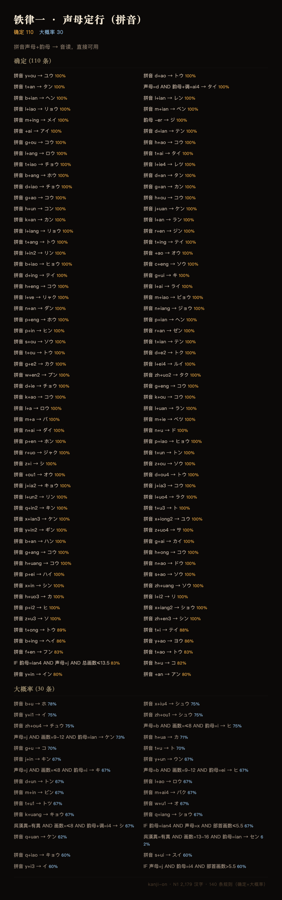
*图：铁律一 · 声母定行（拼音）— 140 条，确定+大概率*

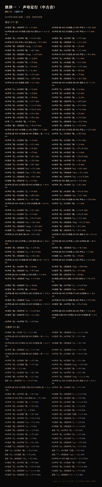
*图：铁律一 · 声母定行（中古音）— 197 条，确定+大概率*

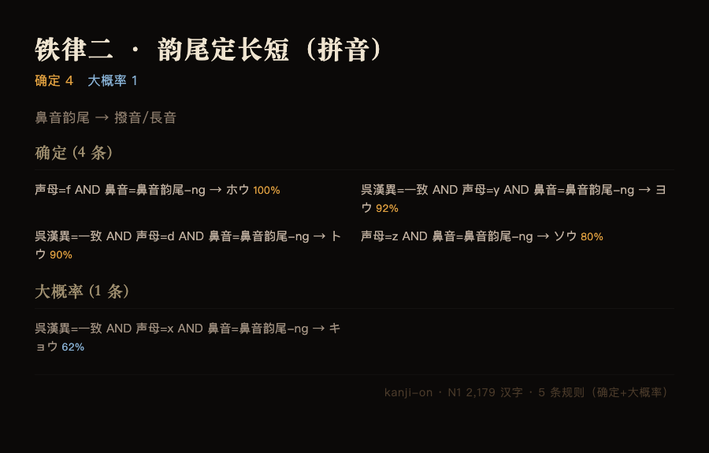
*图：铁律二 · 韵尾定长短（拼音）— 5 条*

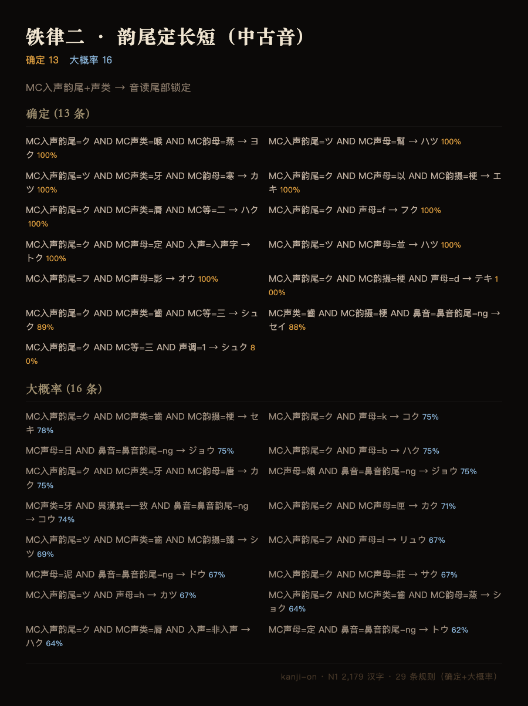
*图：铁律二 · 韵尾定长短（中古音）— 29 条，确定+大概率*

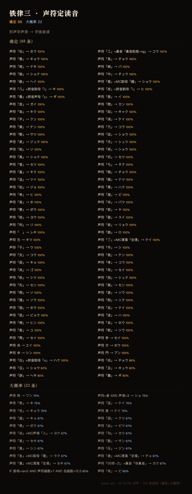
*图：铁律三 · 声符定读音 — 110 条，确定+大概率*

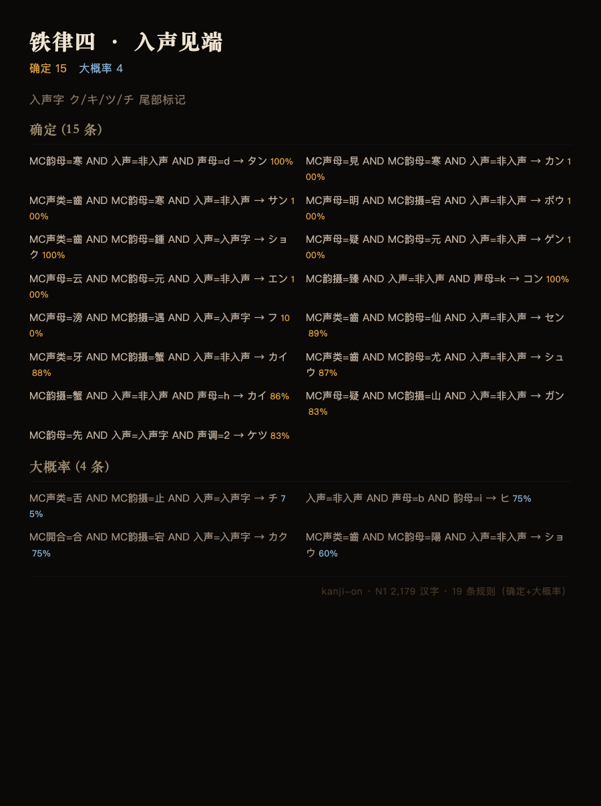
*图：铁律四 · 入声见端 — 19 条，确定+大概率*

---

这五条铁律，加上各自的一张小对照表，在 N1 2,179 个汉字实测中覆盖了 91.4%。精度因铁律而异——前两条（声母 78%、韵尾 98.5%）最高，第三条（声符）在已知声符读音的前提下几乎全对，第四条（入声）提供方向，第五条（呉漢）提供解释。

如果再往深走，系统精选出的 164 条高精度规则（平均精度 98.6%）覆盖了 N1 84.5% 的汉字——**每一拳都是重的**。最后大约 15% 的汉字确实没什么可靠规律，得一个一个记。

回到开头。沪江那篇文章给了你 2 条规律。你刚才读到了 5 条。这不只是多了 3 条——这五条每一条都是一类规律的母体。铁律一定行，铁律二定长短，铁律三定家族，铁律四定尾部，铁律五定来源。遇到任何汉字的音读，都可以往这五条上套一下——至少有一条能告诉你点什么。

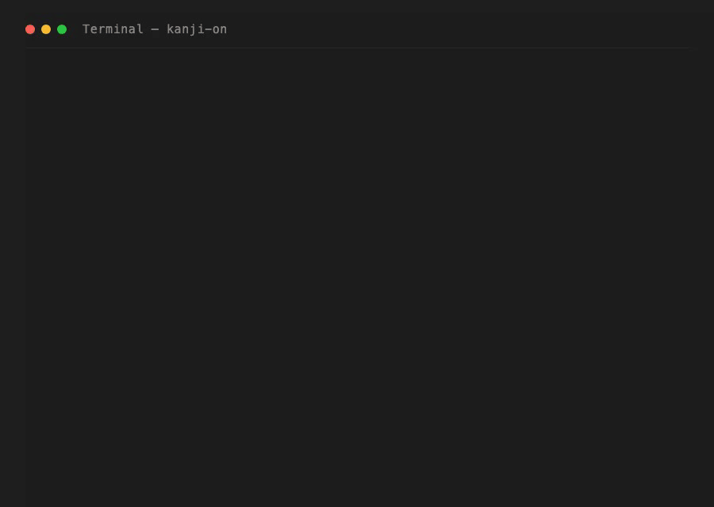
*动图：一行命令查出任何汉字的匹配规则、精度、同规律字、单词*

项目叫 [kanji-on](https://github.com/5Mcv4He/kanji-on)，代码和数据都开源。

*图：kanji-on 开源仓库 — github.com/5Mcv4He/kanji-on*

79,832 条规则、五条铁律的完整映射表、746 条精选规则——全在仓库里。你用不到代码。下次背单词的时候，心里过一遍这五条——声母在哪行？韵尾长还是短？有没有认识的声旁？——你已经比 **99%** 的日语学习者多了一套系统。

—— 关于作者 ——

**五四**。

关注「**5McvH4e-五四**」

Star → [github.com/5Mcv4He/kanji-on](https://github.com/5Mcv4He/kanji-on)
